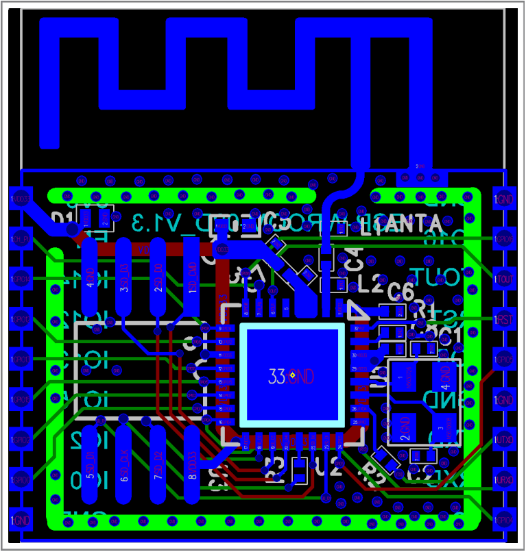

# Demo-IoT-ESP8266

## Datasheets

**ESP8266**

[ESP8266EX](https://www.espressif.com/sites/default/files/documentation/0a-esp8266ex_datasheet_en.pdf), Package Size QFN32-pin (5 mm x 5 mm)

[Hardware Design Guidelines Version 2.8](https://www.espressif.com/sites/default/files/documentation/esp8266_hardware_design_guidelines_en.pdf)

**PCB Layout Design**

